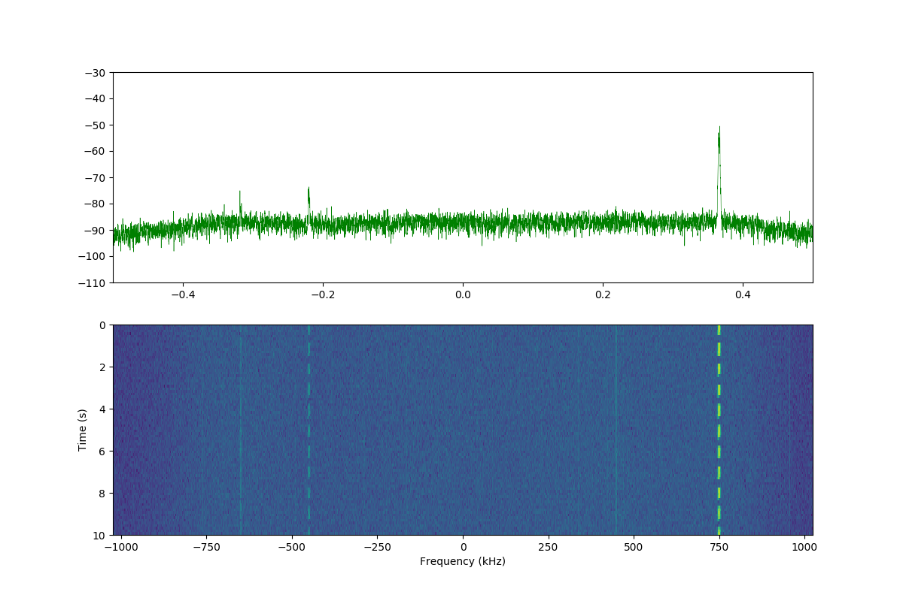

## IQ server/client

receive IF stream from baseband IQ via TCP, default `PORT=1280 (iq_svcl.h)` 

#### Compile
  `gcc -Ofast -c iq_base.c`  
  `gcc -O2 iq_server.c iq_base.o -lm -pthread -o iq_server` 
  `gcc -O2 iq_client.c -o iq_client`  

#### Usage/Examples
  - `T1$ ./iq_server [--port <pn>] <iq_baseband.wav>` 
  `T2$ ./iq_client [--ip <ip_adr>] [--port <pn>] --freq <fq>`

  - Ex.1 
  [terminal 1] 
  `T1$ ./iq_server --bo 32 <iq_baseband.wav>` &nbsp;&nbsp;
  (or &nbsp; `$ ./iq_server --bo 32 - <sr> <bs> <iq_baseband.raw>`) 
  [terminal 2] 
  `T2$ ./iq_client --freq <fq> | ./rs41mod -vx --IQ 0.0 --lp - <if_sr> <bo>`  
  where  
  &nbsp;&nbsp;&nbsp;&nbsp; `-0.5 < fq < 0.5`: (relative) frequency, `fq=frequency/sr`  
  &nbsp;&nbsp;&nbsp;&nbsp; `<if_sr>`: IF sample rate  
  &nbsp;&nbsp;&nbsp;&nbsp; `<bo>=8,16,32`: output/IF bits per (real) sample (u8, s16 or f32)  
  down-converts up to `MAX_FQ=(4+1) (iq_base.h)` channels/signals. (On older CPUs, more signals than number of CPU cores is not recommended.) 
  (Note: If the baseband sample rate has no appropriate factors (e.g. if prime), the IF sample rate might be high and IF-processing slow.) 
  One channel can be used for scanning, e.g. `./iq_server --fft_avg <m> <fft_avg.csv>` makes *m* rows of avg-FFT (FFT_AVG=2 seconds average), and
  this channel will be reused for client FFT requests. Only one channel/thread can be used for FFT/scanning. A client can request a new FFT,
  if the last FFT has finished. 
  There are two kinds of FFTs, `fft_all` and `fft_avg`. `fft_avg` integrates over FFT_AVG=2 seconds and can be used for signal peak scanning.
  For waterfall display, `--fft_all <m> <fft_all.csv>` produces *m*\*FFT_AVG\*FFT_FPS/2 rows of FFT (FFT_AVG seconds, FFT_FPS/2 per sec).
  The FFT is saved in `<fft.csv>` as 
  &nbsp;&nbsp; `sec.ms,freq_min,freq_max,Hz/bin,N_bins, db_1,...,db_N` 
  approx. 200 Hz per bin.
  Choose `filename="-"` for `stdout`. 
  If no output bps is chosen (`--bo [8,16,32]`), the IF bps is equal to the baseband bps. It is recommended to use
  `--bo 32` (i.e. float32) output, then no quantization noise is introduced when converting from internal float32 samples. 

  - Ex.2 
  [terminal 1] 
  `T1$ rtl_sdr -f 403.0M -s 1920000 - | ./iq_server --fft_avg 1 fft_server.csv --bo 32 - 1920000 8` 
  [terminal 2] 
  `T2$ ./iq_client --freq -0.3125 | ./m10mod -c -vv --IQ 0.0 - 48000 32` 
  [terminal 3] 
  `T3$ ./iq_client --freq 0.0 | ./rs41mod -vx --IQ 0.0 - 48000 32` 
  [terminal 4] 
  `T4$ ./iq_client -1` &nbsp;&nbsp; (*close channel 1*) 
  `T4$ ./iq_client --stop` &nbsp;&nbsp; (*close all clients and stop server*) 

  - The `iq_server` FFT options immediately start reading the IQ stream (so buffering is reduced). 
  `./iq_client <fft_opt> <m> <fft_cl.txt>`, where `<fft_opt>=--fft_avg_cl` or `--fft_all_cl`, requests FFT from the server. 
  (`<fft_opt>=--fft_avg_sv/--fft_all_sv` would save the FFT at the server, but only if `./iq_server --enable_clsv_out`.) 
  The IF sample rate `if_sr` is at least 48000 and such that the baseband sample rate `sr` is a multiple of `if_sr`.

  - Ex.3 
  [terminal 1] 
  `T1$ rtl_sdr -f 404550k -s 2048000 - | ./iq_server --fft_avg 1 fft_avg.csv --bo 32 - 2048000 8` 
  (scan FFT: `./scan_fft fft_avg.csv`) 
  [terminal 3] 
  `T3$ ./iq_client --fft_all_cl -1 - | python plot_fft_ani.py 3 -` 
  

